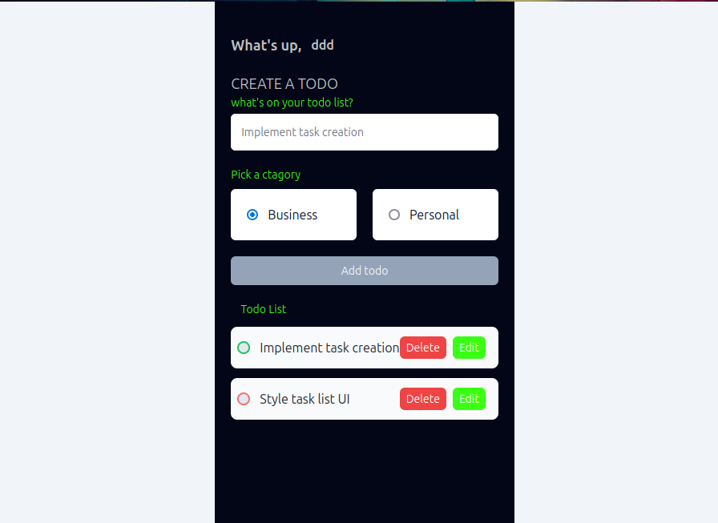

# Simple TodoApp

This is a simple todoApp built with Vue.js and Tailwind CSS. It allows users to add, remove, and mark tasks as completed, with data persisting in the browser's local storage.

## Features

- Add new tasks
- Mark tasks as completed
- Remove tasks
- Data persists in local storage

## Technologies Used

- Vue.js: A progressive JavaScript framework for building user interfaces.
- Tailwind CSS: A utility-first CSS framework for building custom designs quickly.
- Local Storage: A web storage API supported by modern web browsers for storing data locally in the user's browser.

## Project Setup

